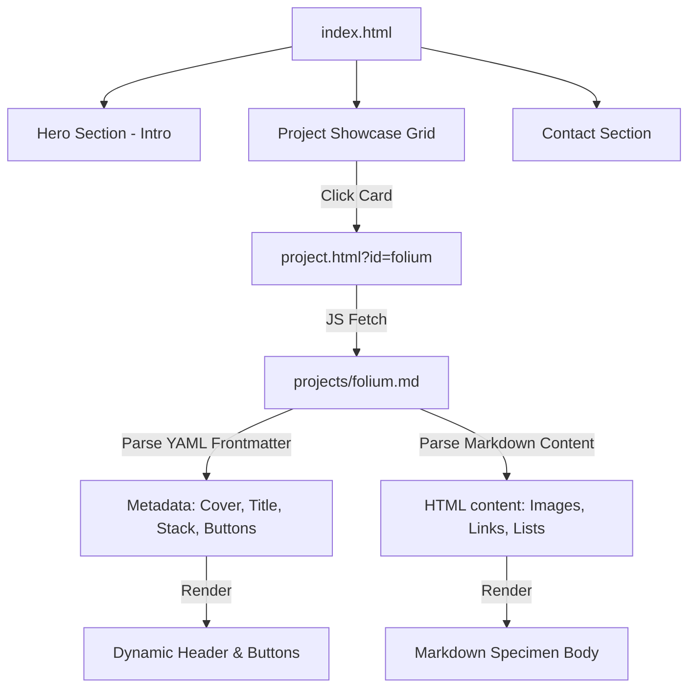

# 🗺️ Portfolio Implementation Roadmap & Architecture Plan
**Project:** PoltorProgrammer Digital Garden & Portfolio  
**Target Architecture:** Vanilla HTML5, CSS3 (Modern Glassmorphism & Micro-animations), and Client-Side Vanilla JavaScript  
**Author:** Antigravity (Google DeepMind Team)  

---

## 👁️ 1. Executive Vision

The **PoltorProgrammer Digital Garden** is a state-of-the-art, lightning-fast personal portfolio. It is designed to look premium, interactive, and modern. Instead of a basic static website, this architecture provides a **completely dynamic, database-free project showcase** that reads standard `.md` (Markdown) files directly from a directory, parses their frontmatter metadata and content client-side, and renders them into rich HTML layouts with support for images, interactive badges, customizable buttons, and embedded media.

### 🎨 Visual & Theme Identity

*   **Design & Theme Reference:** The visual style, look-and-feel, and aesthetic identity of the portfolio must align perfectly with your existing **MediXtract reference** design.
*   **Hero Section Atmosphere:** The Hero/Introduction section must adopt the **"Aquarium" design** of the MediXtract landing page — utilizing a deep sea/ocean gradient first-class backdrop, ambient floating particles, high-contrast crisp text hierarchy, and micro-animations that feel like floating ocean organisms.
*   **Aesthetics:** Premium glassmorphism cards, soft glowing neon borders, and interactive transitions that mimic the immersive, fluid, and animated atmosphere of the aquarium interface.

---

## 🏛️ 2. Site Architecture Blueprint



### 📍 Section 1: Introduction & Hero
*   **Vibe:** Professional, welcoming, and high-tech.
*   **Features:**
    *   **Interactive Particle Backdrop:** A lightweight, pure CSS or canvas-based background movement that reacts subtly to cursor movements.
    *   **Typewriter Effect:** Cycling through roles: `Botanical Developer`, `AI System Architect`, `Full-Stack Programmer`.
    *   **Key Repositories Summary Strip:** A sleek, self-updating-style strip showing your top metrics (e.g. `29 Repositories`, `23 Original Creations`, `2 Private Initiatives`).
    *   **Call-to-Action (CTA):** "Explore Garden" (smooth scrolls to Projects) and "Get in Touch" (smooth scrolls to Contact).

### 📍 Section 2: Interactive Project Showcase Grid
*   **Vibe:** Visual, organized, and searchable.
*   **Features:**
    *   **Live Search Bar & Filters:** Filter buttons for domains: `All`, `Botanical (TFG)`, `AI & Data`, `Games`, `Tools`.
    *   **Dynamic Repository Cards:** Cards that elevate on hover with a glowing border.
    *   **Visibility Badges:** Clear indicator badges (🌐 **Public** / 🔒 **Private**) so visitors know what they can explore or access.
    *   **Read More Buttons:** Clicking triggers a smooth overlay or redirects to a unified `project.html?id=project-name` reader.

### 📍 Section 3: Premium Contact Section
*   **Vibe:** Frictionless and highly styled.
*   **Features:**
    *   **Glassmorphic Form Container:** Beautifully styled input fields with sliding focus borders.
    *   **Secure Client-Side Messaging:** Pre-configured integration with Formspree, EmailJS, or standard Web3Forms (requiring zero backend servers).
    *   **Social & Git Cards:** Custom links pointing directly to your GitHub profile and LinkedIn.

---

## ⚙️ 3. Markdown-to-HTML Rendering System

This is the core engineering solution for your projects section. It allows you to add or modify projects by simply dropping standard Markdown files (`.md`) into a `projects/` folder.

### 📂 Directory Layout
```text
/poltor-programmer-website
│
├── index.html            # Main portfolio portal (Intro, Grid, Contact)
├── project.html          # Dynamic, single-page reader for project details
├── index.css             # Main styling system, design tokens & transitions
├── main.js               # Search, filters, grid generation & contact form JS
├── reader.js             # Core Markdown rendering engine
│
├── projects/             # Folder containing your project markdown files
│   ├── folium.md
│   ├── medixtract.md
│   └── taboup.md
│
└── assets/               # Images, SVGs, and brand files
```

### 📝 Sample Project Markdown File (`projects/folium.md`)
Each project markdown file starts with a **YAML-like Frontmatter Block** enclosed in `---` lines. The JavaScript reader will parse this header block to render custom cards, headers, stacks, and action buttons.

```markdown
---
title: "Folium Botanical Cataloging App"
subtitle: "Production-grade React Native & Supabase ecosystem for the UAB campus."
cover_image: "assets/folium_cover.jpg"
visibility: "Private"
category: "TFG"
tech_stack: ["React Native", "Expo", "Supabase", "PostGIS", "TypeScript"]
demo_url: "https://expo.dev/preview/folium"
github_url: "file:///c:/___Folium/Folium"
status: "Completed (May 2026)"
button_text: "View EAS Build Specs"
button_link: "#build-specs"
---

# Folium Project Overview

Biodiversity monitoring at fine geographic scales faces a persistent gap between the availability of generic citizen science platforms and the specific needs of bounded locations. **Folium** bridges this gap.

## Key System Accomplishments
* **consensus-based validation model** adapted from iNaturalist's Research Grade model.
* **Row-Level Security (RLS)** in Supabase to protect private coordinates.
* **Pl@ntNet API** integration for automated plant pre-identification.


> [!IMPORTANT]
> The system has a strict GDPR Article 17 self-serve account erasure function.

For details, review our full development documentation or clone the associated testing folders.
```

---

## 🛠️ 4. Technical Engine: How the Markdown Reader Works (Vanilla JS)

To render these files dynamically without a heavy framework like Next.js, we will use a small, reliable client-side library like **`marked.js`** to translate markdown to HTML, combined with a lightweight frontmatter parser in `reader.js`.

Below is the exact script we will implement in your `reader.js` to read and render your projects:

```javascript
// reader.js - Core Project Loader & Render Engine
document.addEventListener("DOMContentLoaded", () => {
    // 1. Extract project ID from URL parameters (e.g., project.html?id=folium)
    const params = new URLSearchParams(window.location.search);
    const projectId = params.get("id");

    if (!projectId) {
        window.location.href = "index.html";
        return;
    }

    // 2. Fetch markdown file from the projects folder
    fetch(`projects/${projectId}.md`)
        .then(response => {
            if (!response.ok) throw new Error("Project file not found");
            return response.text();
        })
        .then(markdownText => {
            renderProject(markdownText);
        })
        .catch(err => {
            console.error(err);
            document.getElementById("project-content").innerHTML = `
                <div class="error-container">
                    <h2>⚠️ Project Not Found</h2>
                    <p>The requested project markdown could not be retrieved.</p>
                    <a href="index.html" class="btn btn-primary">Return Home</a>
                </div>
            `;
        });
});

// 3. Parse YAML Frontmatter & Markdown
function renderProject(rawText) {
    const frontmatterRegex = /^---\r?\n([\s\S]*?)\r?\n---\r?\n([\s\S]*)$/;
    const match = rawText.match(frontmatterRegex);

    let metadata = {};
    let contentMarkdown = rawText;

    if (match) {
        const yamlText = match[1];
        contentMarkdown = match[2];

        // Simple YAML parser
        yamlText.split('\n').forEach(line => {
            const separatorIdx = line.indexOf(':');
            if (separatorIdx !== -1) {
                const key = line.substring(0, separatorIdx).trim();
                let val = line.substring(separatorIdx + 1).trim();
                // Strip outer quotes if present
                if (val.startsWith('"') && val.endsWith('"')) {
                    val = val.substring(1, val.length - 1);
                }
                // Handle arrays (e.g., ["React", "Expo"])
                if (val.startsWith('[') && val.endsWith(']')) {
                    try {
                        val = JSON.parse(val.replace(/'/g, '"'));
                    } catch (e) {
                        val = val.substring(1, val.length - 1).split(',').map(s => s.trim());
                    }
                }
                metadata[key] = val;
            }
        });
    }

    // 4. Update Header Elements & Metadata
    document.title = `${metadata.title || "Project Detail"} | PoltorProgrammer`;
    document.getElementById("project-title").innerText = metadata.title || "Untitled Project";
    document.getElementById("project-subtitle").innerText = metadata.subtitle || "";
    
    if (metadata.cover_image) {
        const banner = document.getElementById("project-banner");
        banner.style.backgroundImage = `url(${metadata.cover_image})`;
        banner.style.display = "block";
    }

    // Generate tech stack badges
    const badgeContainer = document.getElementById("tech-badges");
    badgeContainer.innerHTML = "";
    if (metadata.tech_stack) {
        metadata.tech_stack.forEach(tech => {
            const badge = document.createElement("span");
            badge.className = "badge-pill";
            badge.innerText = tech;
            badgeContainer.appendChild(badge);
        });
    }

    // Action buttons
    const btnContainer = document.getElementById("action-buttons");
    btnContainer.innerHTML = "";
    if (metadata.github_url) {
        btnContainer.innerHTML += `<a href="${metadata.github_url}" class="btn-action btn-git"><i class="fab fa-github"></i> Source Code</a>`;
    }
    if (metadata.demo_url) {
        btnContainer.innerHTML += `<a href="${metadata.demo_url}" target="_blank" class="btn-action btn-demo"><i class="fas fa-external-link-alt"></i> Live Demo</a>`;
    }

    // 5. Parse and Render Markdown Body using marked.js
    // Note: We can include custom rules or alerts in the parser
    let htmlContent = marked.parse(contentMarkdown);
    
    // Support Github Alert Blocks (e.g., > [!NOTE])
    htmlContent = htmlContent.replace(
        /<blockquote>\s*<p>\s*\[!(NOTE|TIP|IMPORTANT|WARNING|CAUTION)\]([\s\S]*?)<\/p>\s*<\/blockquote>/g,
        (m, type, text) => {
            return `<div class="alert-block alert-${type.toLowerCase()}">
                <span class="alert-indicator">${type}</span>
                <p>${text.trim()}</p>
            </div>`;
        }
    );

    document.getElementById("project-body").innerHTML = htmlContent;
}
```

---

## 📅 5. Phase-by-Phase Implementation Plan

We will proceed iteratively to ensure maximum quality and aesthetic finish:

*   **Phase 1: Foundation & Visual Alignment**
    *   Initialize styling to replicate the MediXtract aquarium appearance, set up responsive grids, and standard visual components.
*   **Phase 2: index.html Scaffold & Hero Module**
    *   Code the navigation, Hero typewriter animation, and the overall responsive grid containers.
*   **Phase 3: The Project Loader & Marked.js Integration**
    *   Create the `projects/` directory, drop sample `.md` files (such as `folium.md`, `medixtract.md`, `taboup.md`).
    *   Setup `project.html` and `reader.js` with direct JSON-like Frontmatter parsing.
*   **Phase 4: Search, Filters & Cards Generator**
    *   Configure `main.js` to automatically list available projects on the homepage grid based on a simple index list, enabling fast searching and category filtering.
*   **Phase 5: Contact Form Integration & Polish**
    *   Build the premium dynamic form, connect transactional message APIs, and perform mobile/tablet responsive testing.

---

> [!TIP]
> Since you have already developed **RenderDown** (a lightweight Markdown browser parser), we can easily adapt your custom parsing algorithms or use standard libraries like `marked.min.js` loaded via CDN to guarantee 100% stable conversion with zero build steps!
