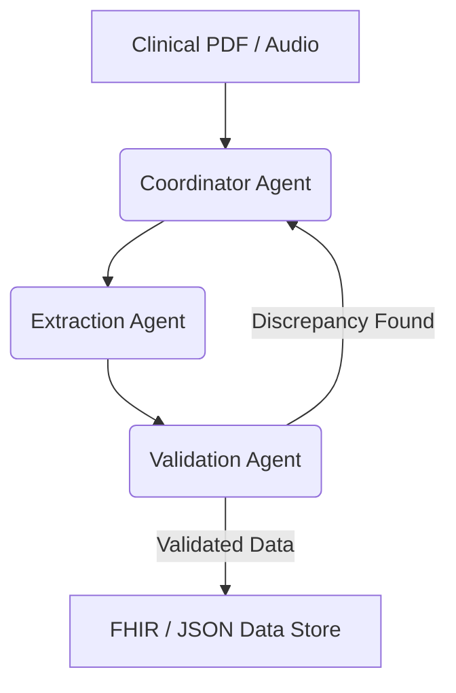

# Architect MediXtract — System Architecture & Prompts

A confidential system planning repository detailing the end-to-end technical specifications, database relationships, and multi-agent interaction prompts that drive the **MediXtract** platform.

## Overview

This repository holds the architectural blueprint and advanced system instruction models used to orchestrate MediXtract's clinical data extraction capabilities. It defines how autonomous agents collaborate to convert unstructured PDFs and audio records into secure, validated FHIR/JSON outputs.

## Key Blueprint Components

- **Multi-Agent Orchestration Schemes** — Specifications for the Coordinator Agent, Extraction Agent, and Validation Agent to interact without race conditions.
- **Advanced System Prompts** — Hardened system instructions that direct LLMs to extract entities (e.g., dosage, frequency, contraindications) strictly within JSON formats.
- **Database E-R Blueprints** — PostGIS and relational database layouts linking patients, original clinical files, extraction transactions, and human-in-the-loop audit logs.
- **Security & DLP Architectures** — Blueprints detailing where and when patient data is de-identified using Google Cloud DLP to guarantee HIPAA compliance.

## Multi-Agent Communication Flow

> [!IMPORTANT]
> This repository is private. The architecture blueprints, orchestration logic, and specialized clinical prompt scripts are strictly confidential to prevent the exposure of security-sensitive operational systems.
